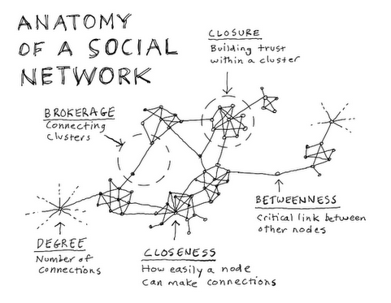
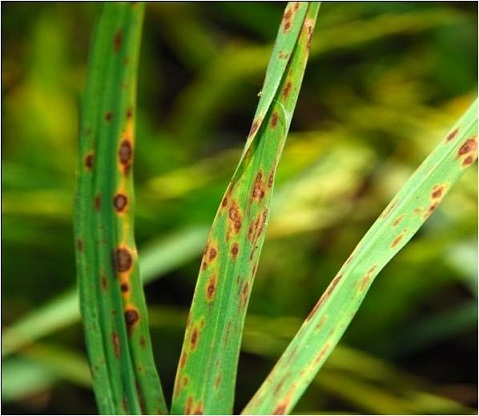
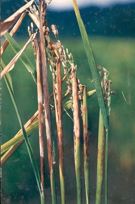

## Network
<div class="columns-2">
  


```
What is a network ? (Easley and Kleinberg, 2011)

a network is any collection of objects in which some parits of these objects
are connected by links

```

<div class="notes">
There is no best format, everything depends on what kind of questions you want to asnwer
</div>

</div>


## Visualization conversion

matrix <- network

table -> matrix -> network


## Table
<div class="centered">
```{r,  echo=FALSE, message=FALSE}
#install.package("qgraph")
library(qgraph)
library(dplyr)
library(ggplot2)
library(corrplot)
adjofgroup <- read.csv(file = "C:/Users/sjaisong/Documents/GitHub/seminar-2015-2/qustionare.csv")
knitr::kable(adjofgroup)
adjofgroup$q1 <- ifelse(adjofgroup$q1 == "Cat", 1, 2)
adjofgroup$q2 <- ifelse(adjofgroup$q2 == "Pencil", 1, 2)
adjofgroup$q3 <- ifelse(adjofgroup$q3 == "Red", 1, 2)
adjofgroup$q4 <- ifelse(adjofgroup$q4 == "Ice cream", 1, 2)
adjofgroup$q5 <- ifelse(adjofgroup$q5 == "Apple", 1, 2)
adjofgroup$q6 <- ifelse(adjofgroup$q6 == "Running", 1, 2)
adjofgroup$q7 <- ifelse(adjofgroup$q7 == "Rice", 1, 2)
adjofgroup$q8 <- ifelse(adjofgroup$q8 == "Chocolate", 1, 2)
adjofgroup$q9 <- ifelse(adjofgroup$q9 == "Samsung", 1, 2)
adjofgroup$q10 <- ifelse(adjofgroup$q10 == "Cake", 1, 2)
name <- adjofgroup$Name
adjofgroup1 <- adjofgroup
adjofgroup$Name <- NULL
mat <- t(adjofgroup)
row.names(mat) <- NULL
colnames(mat) <- name

```
</div>

## Matrix

```{r}
knitr::kable(adjofgroup1)
```

## Adjacency Metrix

```{r}
knitr::kable(cor(mat, method = "spearman"))
```


## Network of shared liking in PDM froup
<div class="centered">
```{r, echo=FALSE}
qgraph(cor(mat, method = "spearman"), layout = "spring", minimum = 0.1, esize = 20, vsize = 10, label.norm = TRUE, node.labels = TRUE, nodeNames = name, legend = TRUE, weighted = FALSE)
title("Network of shared liking in PDM Group ")
```
</div>

## Tie Strength

#### How possible can this person be close friend in the group ?

<div class="centered">
```{r, echo=FALSE}
qgraph(cor(mat, method = "spearman"), layout = "spring", minimum = NULL, nodeNames = name, legend = TRUE) 
title("Network of shared liking in PDM Group \nwith weighted links")
```
</div>


## Measures

#### Centrality, Clustering coefficient..
<div class="columns-2">

- Degree 
- Betweenness
- Closeness


</div>

## Crop Health Data

<div class = "columns-2">

Crop heatlh survey


Record 


</div>


## Output Profiles 

```{r}
load(file = "C:/Users/sjaisong/Documents/GitHub/seminar-2015-2/5-1OutputProfile_subset.RData")
tbl_df(all)

```

## Correlation Matrix

<div class="centered">
```{r, echo=FALSE, fig.height=5, fig.width=5}
all.spear <- cor(all, method = "spearman")

corrplot(all.spear, method = "ellipse")

```
</div>

## Co-occurance Network 

<div class="centered">

```{r, echo=FALSE}

all.spear <- 
        cor(all, method = "spearman")

q.all.spear <- qgraph(all.spear,
            sampleSize = nrow(all),
            graph = 'assosciation',
            minimum = "sig",
            maximum = 0.6,
            # cut = 0.3 ,
            # threshold = "locfdr",
            bonf = TRUE,
            #------ node
            vsize = c(1.5,8),
            #------edge
            borders = FALSE,
            vTrans = 200,
            edge.labels = TRUE,
            edge.label.cex = 0.5,
            layout = "spring",
            title = "Spearman's correlation based Network with bonf correction in South and South East Asia"
)
```
</div>

## Centrality of co-occurence network

<div class="centered">
```{r, echo=FALSE}
centralityPlot(q.all.spear)
```
</div>

## Clustering coeffician

<div class="centered">
```{r, echo=FALSE}
clusZ <- clustZhang(all.spear)
clusZ <- cbind(node = rownames(clusZ), clusZ)
row.names(clusZ) <- NULL
clusZ %>% ggplot( aes(x= clustZhang, y = reorder(node, clustZhang))) + geom_point() + xlab("clustering coefficient") + ylab("Variables") + ggtitle(" Clusering")
```
</div>

## Different Networks

<div class="centered">
```{r, echo=FALSE}
ds.spear.cor <- cor(ds, method = "spearman")
ws.spear.cor <- cor(ws, method = "spearman")
L <- averageLayout(ds.spear.cor, ws.spear.cor)
layout(matrix(c(1,2), 1, 2, byrow = TRUE))

qgraph(ds.spear.cor,
            sampleSize = nrow(all),
            graph = 'assosciation',
            layout = L,
            minimum = "sig",
            maximum = 0.6,
            # cut = 0.3 ,
            # threshold = "locfdr",
            bonf = TRUE,
            #------ node
            vsize = c(1.5,8),
            #------edge
            borders = FALSE,
            vTrans = 200,
            edge.labels = TRUE,
            edge.label.cex = 0.5,
            layout = "spring",
            #filetype = 'pdf',
            #filename ='figs/qgraph.spear.all',
            title = "Dry season Network "
)

qgraph(ws.spear.cor,
            sampleSize = nrow(all),
            graph = 'assosciation',
            layout = L,
            minimum = "sig",
            maximum = 0.6,
            # cut = 0.3 ,
            # threshold = "locfdr",
            bonf = TRUE,
            #------ node
            vsize = c(1.5,8),
            #------edge
            borders = FALSE,
            vTrans = 200,
            edge.labels = TRUE,
            edge.label.cex = 0.5,
            layout = "spring",
            #filetype = 'pdf',
            #filename ='figs/qgraph.spear.all',
            title = "Wet season network "
)
```
</div>

## Centrality of Co-occurence Network in dry season
```{r, echo=FALSE}
centralityPlot(ds.spear.cor)
```
 


## Centrality of Co-occurence Network in wet season
```{r, echo=FALSE}
centralityPlot(ws.spear.cor)
```


## Summary

<div class = "columns-2">

Brown Spot



Sheat Rot


</div>
