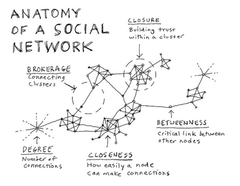

## Network
<div class="columns-2">
  


```
What is a network ? (Easley and Kleinberg, 2011)

a network is any collection of objects in which some parits of these objects
are connected by links

```

<div class="notes">
There is no best format, everything depends on what kind of questions you want to asnwer
</div>

</div>


## Visualization conversion

matrix <- network

table -> matrix -> network


## Table
<div class="centered">

|Name  |q1  |q2       |q3   |q4        |q5    |q6      |q7     |q8         |q9      |q10  |
|:-----|:---|:--------|:----|:---------|:-----|:-------|:------|:----------|:-------|:----|
|Sith  |Dog |Pencil   |Blue |Ice cream |Grape |Running |Rice   |Strawberry |Iphone  |Cake |
|Adam  |Cat |Pencil   |Blue |Coffee    |Grape |Running |Noodle |Chocolate  |Iphone  |Cake |
|Nancy |Dog |Pencil   |Red  |Coffee    |Grape |Running |Rice   |Strawberry |Samsung |Cake |
|Kyle  |Dog |Pencil   |Blue |Coffee    |Apple |Running |Rice   |Chocolate  |Iphone  |Cake |
|Joey  |Dog |Ball pen |Blue |Ice cream |Grape |Running |Rice   |Chocolate  |Samsung |Cake |
</div>

## Matrix


```r
knitr::kable(adjofgroup1)
```


|Name  | q1| q2| q3| q4| q5| q6| q7| q8| q9| q10|
|:-----|--:|--:|--:|--:|--:|--:|--:|--:|--:|---:|
|Sith  |  2|  1|  2|  1|  2|  1|  1|  2|  2|   1|
|Adam  |  1|  1|  2|  2|  2|  1|  2|  1|  2|   1|
|Nancy |  2|  1|  1|  2|  2|  1|  1|  2|  1|   1|
|Kyle  |  2|  1|  2|  2|  1|  1|  1|  1|  2|   1|
|Joey  |  2|  2|  2|  1|  2|  1|  1|  1|  1|   1|

## Adjacency Metrix


```r
knitr::kable(cor(mat, method = "spearman"))
```


|      |      Sith|      Adam|     Nancy|      Kyle|      Joey|
|:-----|---------:|---------:|---------:|---------:|---------:|
|Sith  | 1.0000000| 0.2000000| 0.4082483| 0.4082483| 0.4082483|
|Adam  | 0.2000000| 1.0000000| 0.0000000| 0.4082483| 0.0000000|
|Nancy | 0.4082483| 0.0000000| 1.0000000| 0.1666667| 0.1666667|
|Kyle  | 0.4082483| 0.4082483| 0.1666667| 1.0000000| 0.1666667|
|Joey  | 0.4082483| 0.0000000| 0.1666667| 0.1666667| 1.0000000|


## Network of shared liking in PDM froup
<div class="centered">
 
</div>

## Tie Strength

#### How possible can this person be close friend in the group ?

<div class="centered">
 
</div>


## Measures

<div class="columns-2">
 
 #### Centrality, Clustering coefficient...

- Degree 
- Betweeness
- Closeness


</div>


## Centrality

<div class="centered">
 
</div>


## Output Profiles 


```r
load(file = "C:/Users/sjaisong/Documents/GitHub/seminar-2015-2/5-1OutputProfile_subset.RData")
tbl_df(all)
```

```
## Source: local data frame [420 x 30]
## 
##    ldg  dhx   whx ssx    wma    lfa   defa bphx wbpx awx rbx rbbx glhx
## 1    0 6.07  4.14   0 327.73 124.23 398.30    0    0   0   0    0   13
## 2    0 8.27  0.53   0 339.78 181.41 342.53    1    0   0   0    0   26
## 3  100 0.91  1.96   0 118.07  76.19 250.93    4    0   0   0    0   46
## 4  100 0.91  1.54   0  68.80  22.06  71.46    4    0   0   0    0   50
## 5    0 2.36  1.72   0 439.34 898.72 526.36    1    0   0   1    0   18
## 6    0 0.80  0.48   0 482.58 625.48 400.26    1    0   0   1    0   10
## 7    0 2.33  6.28   0 638.54 274.21 440.60    0    0   0   0    0   93
## 8    0 0.00 12.67   0 508.65 242.46 470.98    2    2   0   0    0   66
## 9    0 1.85  0.00   0 153.86 895.72 601.47    1    0   0   1    0    9
## 10   0 0.00  0.00   0 317.71 804.07 595.66    5    0   1   0    0   12
## .. ...  ...   ... ...    ...    ...    ...  ...  ... ... ...  ...  ...
## Variables not shown: stbx (dbl), blba (dbl), lba (dbl), bsa (dbl), blsa
##   (dbl), nbsa (dbl), rsa (dbl), lsa (dbl), shbx (dbl), shrx (dbl), srx
##   (dbl), fsmx (dbl), nbx (dbl), dpx (dbl), rtdx (dbl), rsdx (dbl), rtx
##   (dbl)
```

## Co-occurance Network 

<div class="centered">

 
</div>

## Centrality of co-occureance network

<div class="centered">
 
</div>

## Clustering coeffician

<div class="centered">
 
</div>

## Different Networks

<div class="centered">
 
</div>

## Summary

- Focused on predominant properties of nodes in network node strength, betweeness, and clustering coefficient, **brown spot** has high node strength and betweeness, but it has  moderate clustering coefficent. This indicate that **brown spot** is properly more important in passing information through the network, or between other clusters, and might be an intereesting targat for intervention.

- False smut high clustering coefficent (Barrat' equation), whereas it has low strength and betweeness. This indicates that other injuies do not easily affect response of **Sheath rot** to positive, or negative incidence, but if **Sheath rot** is reponsed, the cluster will tend to reponses because of the high interconnectivity (high clustering coefficent).
